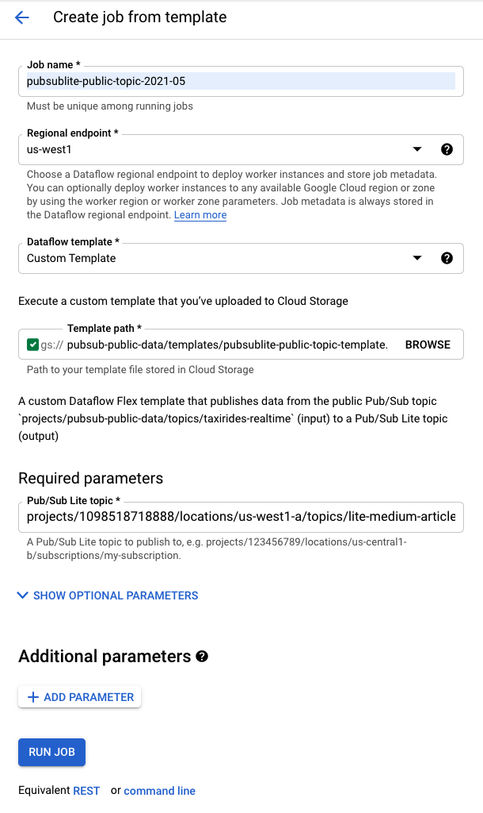

# Pub/Sub Lite public topic template

This repo contains code for ["Is there a public Pub/Sub Lite topic?"]() on Medium. 

Specifically, it contains code that creates the public Dataflow template image `gcr.io/pubsub-public-data/pubsublite-public-topic-template:latest` that publishes messages from the Pub/Sub public topic `projects/pubsub-public-data/topics/taxirides-realtime` to your Pub/Sub Lite topic.

## How is the template created?

The steps below describe how to create the template in your Google Cloud project.

1. Package a fat JAR. You should see `target/pubsublite-public-topic-template-bundled-1.0-SNAPSHOT.jar` as an output.
    ```sh
    mvn clean package -DskipTests=true
    ls -lh target/
    ``` 

1. Provide names and locations for template file and template container image. You will need to provide your own names and locations here.
    ```sh
    export TEMPLATE_PATH="gs://pubsub-public-data/templates/pubsublite-public-topic-template.json"
    export TEMPLATE_IMAGE="gcr.io/pubsub-public-data/pubsublite-public-topic-template:latest"
    ```

1. Build a custom Flex template.
    ```sh
    gcloud dataflow flex-template build $TEMPLATE_PATH \
      --image-gcr-path=$TEMPLATE_IMAGE \
      --sdk-language="JAVA" \
      --flex-template-base-image="JAVA11" \
      --metadata-file="metadata.json" \
      --jar="target/pubsublite-public-topic-template-bundled-1.0-SNAPSHOT.jar" \
      --env FLEX_TEMPLATE_JAVA_MAIN_CLASS="LitePublicTopicTemplate"
    ```
## How to run the template?

Running the template requires you to have a *Pub/Sub lite topic* already created. 

With that, you can create a job from template in [Cloud Console](https://pantheon.corp.google.com/dataflow/createjob).



Alternatively, you can create a job using this gcloud command:

```sh
gcloud dataflow flex-template run "pubsublite-to-gcs-`date +%Y%m%d`" \
   --template-file-gcs-location $TEMPLATE_PATH \
   --parameters pubsubLiteTopic="projects/123456789/locations/us-west1-a/topics/my-topic" \
   --region us-west1
```


